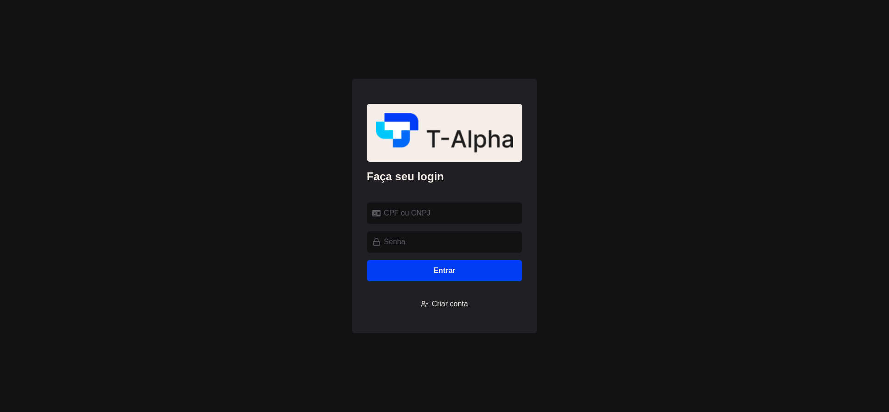
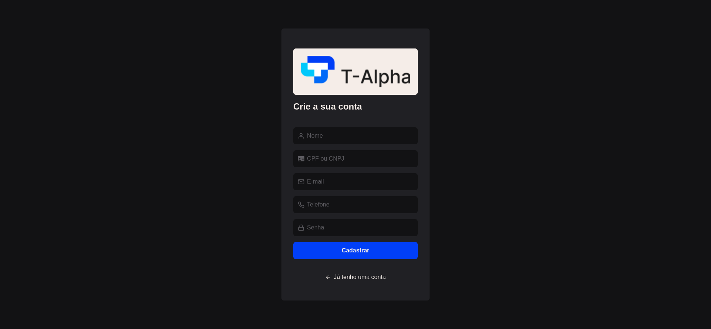
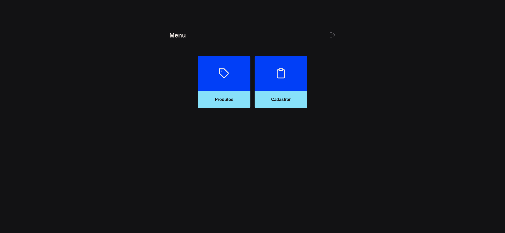
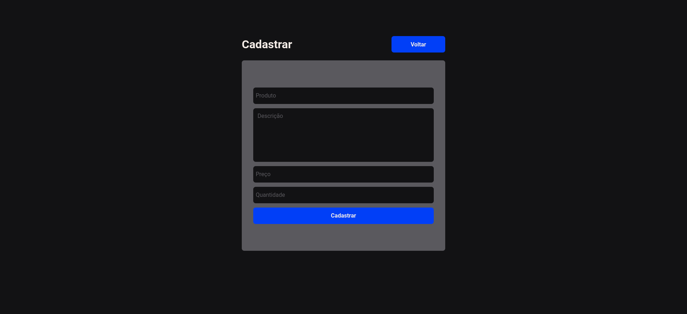
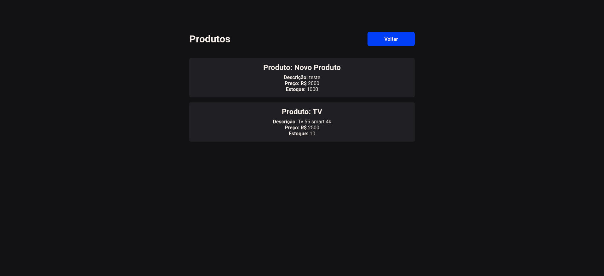
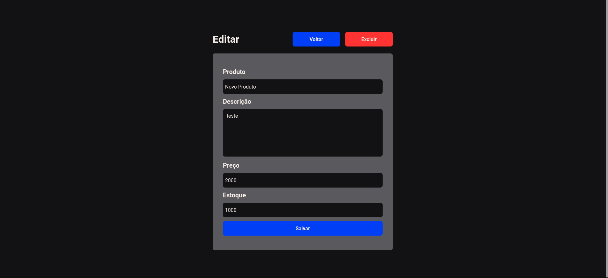

<h1 align="center">📃 T-Alpha </h1>


## 📁 Projeto

- plicação front-end que permite a autenticação de usuários e a gestão (CRUD) de produtos. Esta aplicação foi desenvolvida utilizando [ReactJS/React Native/Angular] e está integrada com uma API de back-end fornecida.

## 📃 Páginas

- A aplicação conta com páginas de login, cadastro, visualizar produto, editar,criar e remover produto.

<div align="center">
  
  
  
  
  
  
</div>

## ⭐ Site

A aplicação RocketMovies está disponível para utilização [aqui]().

## 🛠️ Funcionalidades

- Login;
- Cadastro;
- Cadastrar produto;
- Mostrar produtos;
- Mostrar detalhes do produto;
- Excluir produto;
- Logout;

## 🚀 Tecnologias

Este projeto foi desenvolvido com as seguintes tecnologias:

- ViteJS;
- ReactJS;
- Styled Components;
- React Icons;
- React Router;
- Axios;

## 🎡 Rodando o projeto localmente

```
$ git clone https://github.com/pcaldi/t-alpha
$ cd t-alpha
$ npm install
$ npm run dev
```
## 👨🏻‍💻 Autor

<a href="https://github.com/pcaldi">
 
 <br />
 <sub><b>Paulo Caldi</b></sub></a> <a href="https://github.com/pcaldi" title="emoji">🙋🏻</a>
 <br />

[](https://www.linkedin.com/in/pcaldi/)
[](mailto:pcaldi@gmail.com)


---
